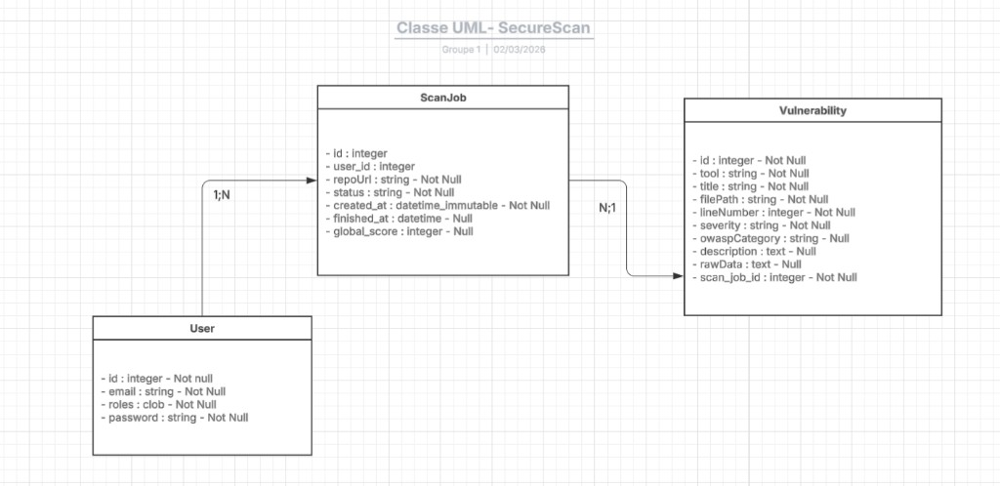
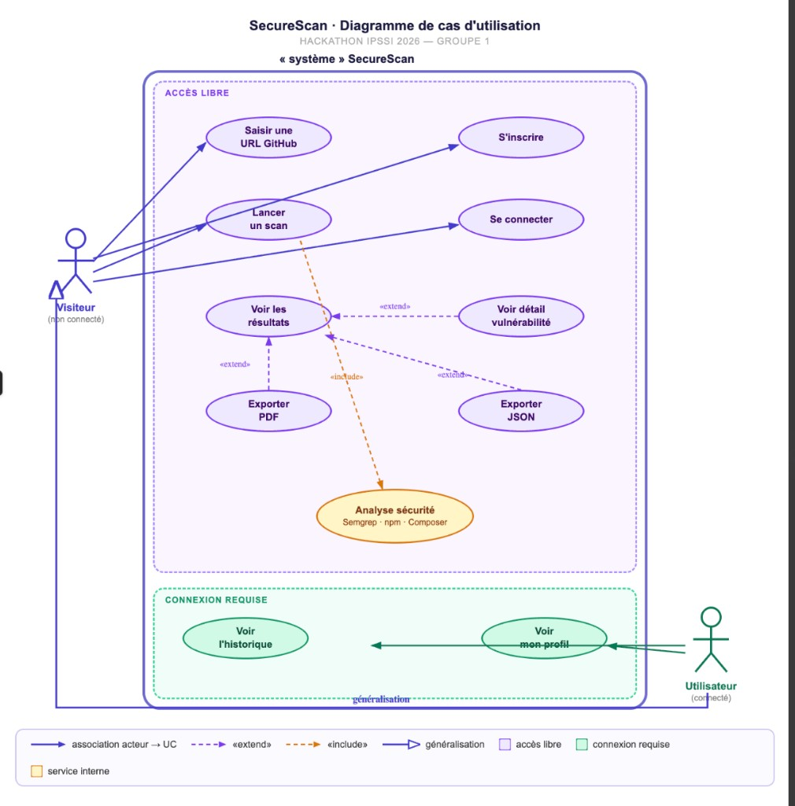
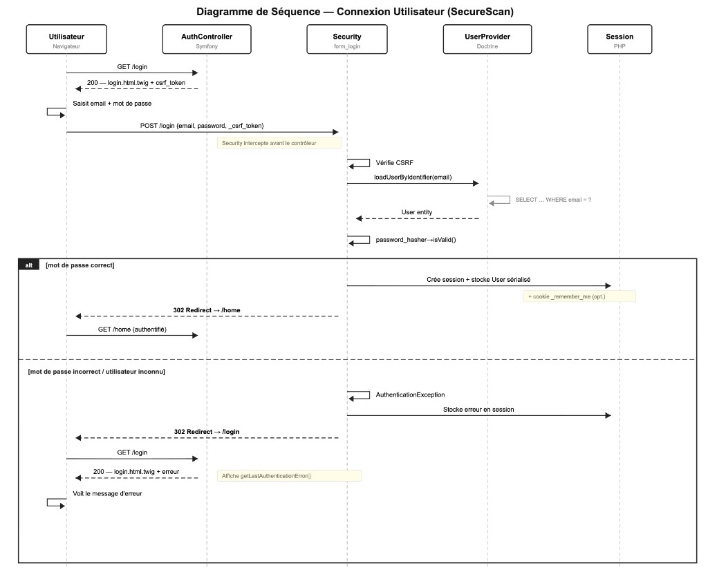

# SecureScan

Plateforme web d'analyse de sécurité de code source basée sur l'OWASP 2025.  
SecureScan orchestre plusieurs outils d'analyse open source, agrège leurs résultats et les présente dans un dashboard interactif avec export PDF/JSON.

---

## Maquette Figma

📐 [Maquette SecureScan sur Figma](https://www.figma.com/design/jCtbaKOAAK7qyXQPsV8wNn/SecureScan?node-id=0-1&t=KX6jfAAdLHNkKd2T-1)

---

## Fonctionnalités

- **Analyse automatisée** depuis une URL de dépôt GitHub public
- **3 outils d'analyse intégrés** :
  - [Semgrep]— analyse statique du code source (SAST)
  - [npm audit]— audit des dépendances Node.js
  - [Composer audit] — audit des dépendances PHP
- **Mapping OWASP Top 10 2025** — chaque vulnérabilité est catégorisée
- **Score de sécurité** calculé avec une formule multiplicative (0–100)
- **Dashboard interactif** avec filtres par sévérité et détail par vulnérabilité
- **Export PDF** (rapport complet avec titre, résumé, tableau et détail) et **JSON**
- **Historique des scans** par utilisateur connecté
- **Authentification** — inscription / connexion (optionnel pour lancer un scan)

---

## Stack technique

| Couche | Technologie |
|--------|-------------|
| Backend | PHP 8.2 · Symfony 7 |
| Base de données | SQLite (via Doctrine ORM) |
| Analyse | Semgrep · npm audit · Composer audit |
| PDF | DomPDF |
| Frontend | Twig · CSS |
| Environnement | Docker |

---


## Installation et démarrage

### 1. Cloner le dépôt

```bash
git clone https://github.com/fluffy1211/securescan-groupe-1.git
cd securescan-groupe-1
```

### 2. Lancer les conteneurs

```bash
docker-compose up --build -d
```

Le premier build peut prendre quelques minutes (installation de Semgrep, npm, Composer…).

### 3. Initialiser la base de données

```bash
docker exec securescan-app php bin/console doctrine:migrations:migrate --no-interaction
```

### 4. Accéder à l'application

Ouvrez [http://localhost:8000](http://localhost:8000) dans votre navigateur.

---

## Utilisation

### Lancer un scan

1. Collez l'URL d'un dépôt GitHub public dans le champ de la page d'accueil
2. Cliquez sur **Analyser**
3. Attendez la fin de l'analyse (page de chargement animée)
4. Le dashboard s'affiche avec le score, les vulnérabilités et le mapping OWASP

### Exporter le rapport

Depuis le dashboard, cliquez sur **PDF** ou **JSON** pour télécharger le rapport.

### Historique

L'historique est disponible uniquement pour les utilisateurs connectés et n'affiche que leurs propres scans.

---

## Architecture

```
securescan/
├── src/
│   ├── Controller/
│   │   ├── AuthController.php        # Inscription / Connexion
│   │   ├── HomeController.php        # Page d'accueil + saisie URL
│   │   ├── ScanController.php        # Lancement et suivi du scan
│   │   ├── DashboardController.php   # Résultats + export PDF/JSON
│   │   ├── HistoryController.php     # Historique par utilisateur
│   │   ├── VulnController.php        # Détail d'une vulnérabilité
│   │   └── ProfileController.php     # Profil utilisateur
│   ├── Entity/
│   │   ├── User.php                  # Utilisateur (auth)
│   │   ├── ScanJob.php               # Scan (statut, score, relation User)
│   │   └── Vulnerability.php         # Vulnérabilité détectée
│   ├── Service/
│   │   ├── AuditOrchestratorService.php     # Orchestrateur (clone + 3 outils + score)
│   │   ├── SemgrepAuditService.php          # Analyse statique SAST
│   │   ├── ComposerAuditService.php         # Audit dépendances PHP
│   │   ├── NpmAuditService.php              # Audit dépendances Node.js
│   │   └── DescriptionTranslatorService.php # Traduction FR des descriptions
│   └── Twig/
│       └── TranslateVulnExtension.php       # Filtre Twig vuln_fr
├── templates/
│   ├── base.html.twig
│   ├── home/        dashboard/        history/
│   ├── scan/        vuln/             profile/
│   └── auth/
├── migrations/                         # Migrations Doctrine
├── docker/
│   └── php/entrypoint-dev.sh          # Config PHP-FPM + cache Semgrep
├── Dockerfile
└── docker-compose.yml
```

### Pipeline d'analyse

```
URL GitHub
    │
    ▼
ScanController → crée ScanJob (pending) → redirige vers page de chargement
    │
    ▼ (appel AJAX)
AuditOrchestratorService::audit()
    ├── git clone du dépôt dans /tmp/scanjob-{id}
    ├── SemgrepAuditService   → vulnérabilités SAST
    ├── ComposerAuditService  → dépendances PHP vulnérables
    ├── NpmAuditService       → dépendances Node.js vulnérables
    ├── computeScore()        → formule multiplicative (100 × ∏(1 - poids))
    └── ScanJob status = done → redirection Dashboard
```

---

## Diagrammes

### Diagramme de classes UML



*Entités User, ScanJob, Vulnerability et leurs relations (Groupe 1 — 02/03/2026)*

### Diagramme de cas d'utilisation



*Fonctionnalités en accès libre (Visiteur) et connexion requise (Utilisateur connecté)*

### Diagramme de séquence — Connexion utilisateur



*Flux d'authentification : AuthController, Security (form_login), UserProvider, Session*

---

## Scoring

Le score global est calculé par **décroissance multiplicative** :

```
score = 100
pour chaque vulnérabilité :
    score = score × (1 - poids / 1000)

Poids : error = 15  |  warning = 6  |  info = 2
```

Un projet sans vulnérabilité obtient **100/100**.  
Un projet très vulnérable converge vers **0**.

---

## Variables d'environnement

Le fichier `.env` à la racine contient la configuration principale :

```env
APP_ENV=dev
APP_SECRET=changeme
DATABASE_URL="sqlite:///%kernel.project_dir%/var/securescan.db"
```

---

## Dépôts de test recommandés

| Dépôt | Langages | Outils actifs |
|-------|----------|---------------|
| `https://github.com/digininja/DVWA.git` | PHP | Semgrep + Composer |
| `https://github.com/appsecco/dvna.git` | Node.js | Semgrep + npm audit |
| `https://github.com/WebGoat/WebGoat.git` | Java | Semgrep |

---

## Équipe

Projet réalisé dans le cadre du **Hackathon SecureScan IPSSI 2026** avec :
Gabriel Martin
Chahrazed Soltani
Ayman Mougou
Rayan Degane WAFO MBE
---

